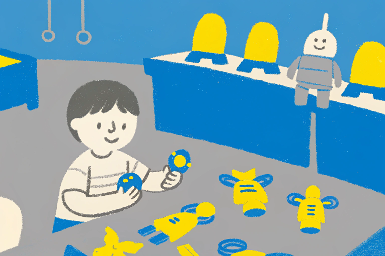
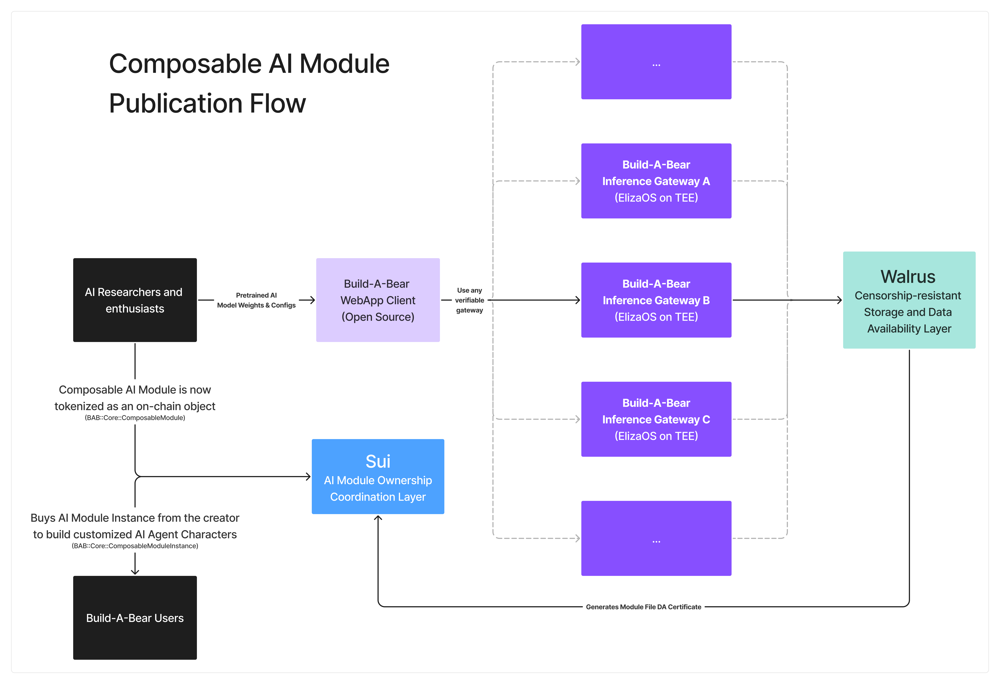
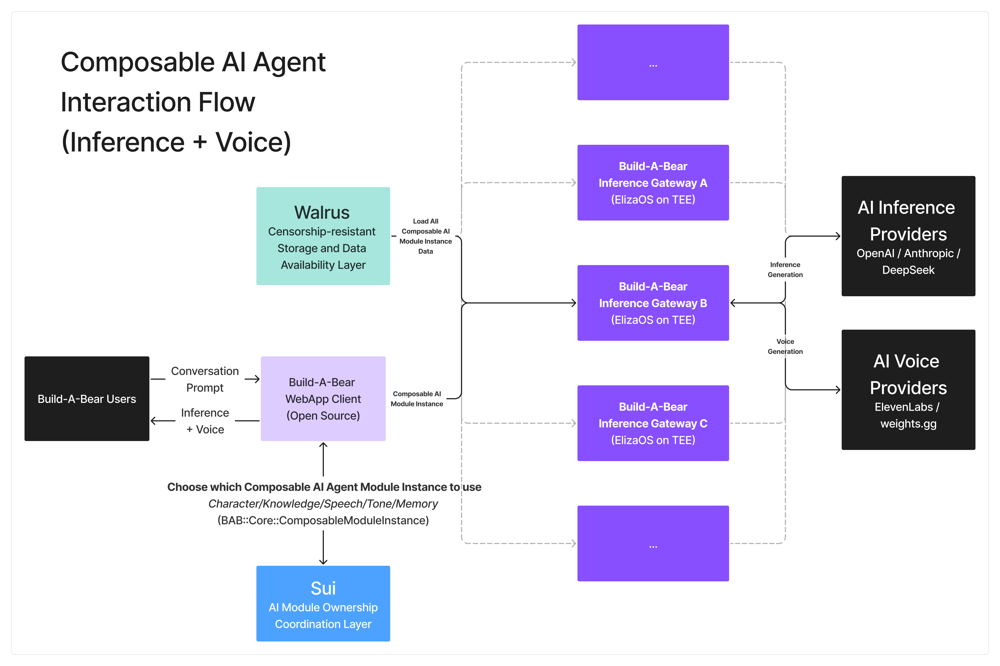

# **Build-A-Bot**: Where Life-Long AI Companions Are Made

**The First-Ever On-Chain Composable AI Agent Character Platform on Sui**

---

## **Project Summary**
**Build-A-Bot (BAB)** is the first-ever on-chain composable AI Agent character platform on Sui. Inspired by the idea of customizing a teddy bear (choosing fabric, filling, and accessories), **BAB** allows users to:

- Cherry-pick and combine different on-chain tokenized AI Agent modules—*Personality*, *Knowledge Bank*, *Speech*, *Tone*, and *Action*—from an open marketplace.
- Compose these modules to create a truly unique **AI Agent Companion** with full on-chain ownership.

This is powered by BAB’s novel **Module-as-a-Service** system, enabling AI researchers and enthusiasts worldwide to:

1. Securely upload and tokenize their pre-trained AI modules (i.e., weights / configuration files).
2. Store these modules on decentralized storage via **Walrus** to ensure data availability and censorship-resistance.
3. Make them openly available in a **composable** and **liquid** marketplace so other users can buy their work and integrate it into their own AI Agents.

With **BAB**, you are no longer constrained to a handful of pre-made AI character templates (like those found on Character.ai). Instead, you can **fully customize** and **own/trade** each component of your AI character, akin to building *Lego blocks* for AI Agents. 

---

## **Core Features**

1. **Securely Tokenize AI Modules with Module-as-a-Service**
   - AI researchers can list their **ComposableModule** (weights/configs) on-chain.
   - Storage is decentralized and censorship-resistant (powered by **Walrus**).
   - Ownership is tokenized, enabling you to buy or sell these modules as **ComposableModuleInstance** assets.

2. **Composable AI Agent Companions**
   - Users on **BAB** can **own different tokenized AI modules** and freely swap them at any time.
   - Don’t like your AI Companion’s current *Tone*? Purchase a different *Tone* module and replace it instantly.
   - Achieve near-infinite customization for **personality**, **knowledge**, **voice**, **actions**, and more.

3. **Full Custody and Persistent Memory**
   - The **Memory Module** is *stateful* and stores all past interactions or knowledge summaries.
   - It is tokenized, encrypted, and remains under the sole control of its owner.
   - As long as you have enough **WAL** tokens for storage, your AI Companion’s memory persists indefinitely on Walrus—ensuring your Agent lives on forever in the decentralized web.

4. **Modular, Extendable, and Backward Compatible**
   - Built with the **BAB Sui Package** for easy addition of future AI features.
   - As AI technology evolves, your AI Agent’s capabilities can grow with it.

---

## **What is the anatomy of a BAB Composable AI Agent?**

A **BAB Composable AI Agent** composes of two categories of modules:

1. **Stateless Functional Modules**
   - **Personality Module**: Defines how the AI Agent speaks, behaves, and its general quirks or traits.
   - **Knowledge Bank Module**: Integrates verifiable external knowledge (e.g., live market prices, textbooks) to provide accurate, real-time responses.
   - **Speech Module**: Controls *text-to-speech* characteristics—pitch, speed, and voice style (masculine or feminine, formal or casual).
   - **Tone Module**: Applies a secondary filter or “character flair” to the speech—could mimic a *Japanese anime character*, *celebrity*, or *historical figure*.
   - **Action Module**: Lets the AI Agent perform external tasks—*sending a tweet*, *executing a transaction on Sui*, etc.

2. **Stateful Memory Module**
   - **Memory Module**: Holds the Agent’s “soul,” capturing conversation histories, personal details, and knowledge summaries. Swapping Memory Modules effectively **replaces the Agent**’s identity—because the memory is what retains continuity of personality and past experiences.

In the **BAB WebApp**, users can **freely permute and compose** new AI characters by layering these modules like building blocks. By choosing any combination of modules, you can instantly form and chat with a uniquely composed AI Agent.

---

## **How AI Researchers & Enthusiasts Can Sell Their Work**

**BAB** provides a straightforward publishing flow:

1. **Drag & Drop Pretrained Model Weights**
   - Choose the module type (Personality, Knowledge Bank, etc.).
   - Upload your data to **Walrus** via a user-friendly UI.

2. **Tokenize Your Module**
   - BAB creates an on-chain **ComposableModule** object, binding your IP/content with a verifiable proof of data availability on Walrus.
   - Anyone who acquires your module’s token can seamlessly integrate it into their AI Agent’s composition.

This opens a **liquid marketplace** for modules, enabling module owners to **profit** from their AI research while **preserving ownership** over the underlying assets.

---

## **How It All Works (System Architecture)**

The **BAB** system is built on top of the foundational work of **ElizaOS**, enhanced with modular loading capabilities for on-the-fly AI Agent module swapping. This architecture is powered by:

1. **Walrus**
   - A **censorship-resistant** and **cost-efficient** data storage layer.
   - Stores AI modules, ensuring high data availability and censorship resilience.

2. **Sui**
   - Used for on-chain module ownership coordination.
   - To do so, we implemented the **ComposableModule** object standards (defined in `BAB::Core::ComposableModule`).
   - Low gas fees and fast finality make **Sui** ideal for frequent on-chain transactions (buying, selling, or swapping modules).

**High-Level Flow**:
1. **Upload & Tokenize** AI Modules → Stored on Walrus, minted as Sui tokens.
2. **Assemble AI Agent** → Pick modules (Personality, Knowledge, Speech, Tone, Action) + attach a Memory Module.
3. **Interact in Real-Time** → Chat, swap modules, or perform actions, all while the Memory Module logs and persists state.

